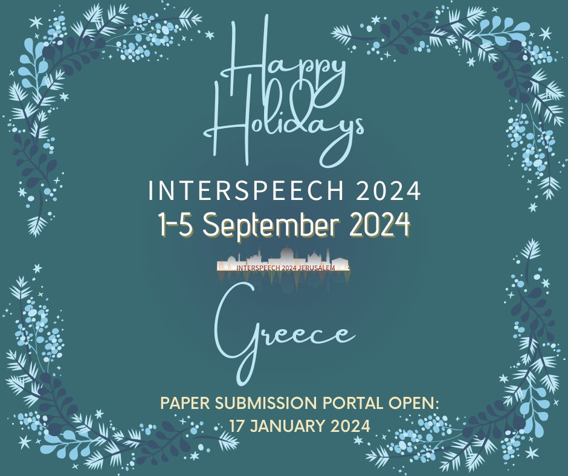

# Faster Audio Transformers 🚀

Merging Tokens to make Audio Transformers faster. (Targeted Conference is Interspeech 2024) 🎙️



This codebase is inspired by the following works:

- [AST by YuanGongND](https://github.com/YuanGongND/ast) 🌌
- [ToMe by Facebook Research](https://github.com/facebookresearch/ToMe) 🤖

## Model Details
**model_size:** 'base384' 📏

## Features of the Repo 🛠️

1. **Faster Attention for Audio Transformers using Token Merging:**
   - Implemented token merging to achieve faster attention for Audio Transformers, improving efficiency without sacrificing performance. 🚀

2. **Knowledge Distillation with DyMN Models:**
   - Knowledge distillation with DyMN models, following the approach outlined in [EfficientAT](https://github.com/fschmid56/EfficientAT), has been implemented. 🤖📚

## Training for Speech Command 🎤

1. **Navigate to the project directory:**
    ```bash
    cd /data/swarup_behera/Research/TOME/ToMe/egs/speechcommands
    ```

2. **Activate the Conda environment:**
    ```bash
    conda activate ast-tome
    
    # or 
    
    conda env create -f environment.yml
    conda activate ast-tome
    ```

3. **Run the training command:**
    ```bash
    CUDA_VISIBLE_DEVICES=2 python -W ignore ../../src/run.py --model ast --dataset speechcommands --data-train ./data/datafiles/speechcommand_train_data.json --data-val ./data/datafiles/speechcommand_valid_data.json --data-eval ./data/datafiles/speechcommand_eval_data.json --exp-dir ./exp/test-speechcommands-f10-t10-pTrue-b32-lr2.5e-4-decoupe --label-csv ./data/speechcommands_class_labels_indices.csv --n_class 35 --lr 2.5e-4 --n-epochs 2 --batch-size 16 --save_model True --freqm 48 --timem 48 --mixup 0.6 --bal none --dataset_mean -6.845978 --dataset_std 5.5654526 --audio_length 128 --noise True --metrics acc --loss BCE --warmup False --lrscheduler_start 5 --lrscheduler_step 1 --lrscheduler_decay 0.85 --tstride 10 --fstride 10 --imagenet_pretrain True --audioset_pretrain False
    ```

## Inference for Speech Command (Evaluation on Speechcommand dataset) 🔍

4. **Navigate to the project directory:**
    ```bash
    cd /data/swarup_behera/Research/TOME/ToMe
    ```

5. **Run the evaluation script:**
    ```bash
    python evaluation_tome.py
    ```

## Details of TOME or Patching AST Model (Our Contribution) 🛠️

In the `src/ast_models.py` file, the following lines were added to patch the AST model with TOME, along with modifications in TOME files:

```python
import sys

sys.path.append('../../')
from evaluation import apply_patch
apply_patch(audio_model)
audio_model.r = 32
sys.path.append(basepath)
